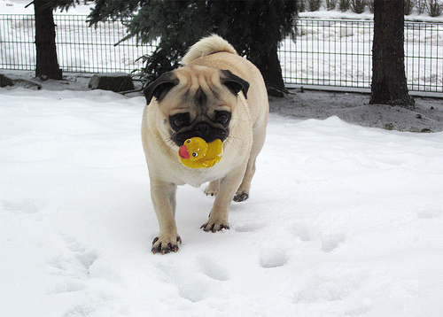

# Classify images using transfer learning from a VGG deep convolutional network.

This is a command-line application to classify images using one of the pre-trained VGG nets available in torch.

# Example

In this example I will use the dogs and cats breeds dataset from [this kagle competition](https://www.kaggle.com/zippyz/cats-and-dogs-breeds-classification-oxford-dataset/data). First I arranged the images to have one folder for each class, and a train, a test and a validation folder with 60%, 20% and 20% of the images respectively. Then I use the `train.py` code, providing the path of the images `catdog/`, the number of epochs to train `-e 5`, and a name to save a checkpoint once the training finishes `-sd chechpoin.pth`. The process took around 4 hours on my computer, but you can use a GPU using the `--gpu` flag. See `python train.py -h` for other options.

``` console
python train.py  catdogs/ -e 5 -sd checkpoint.pth
Training model..
Epoch 1/5.. Train loss: 2.032.. Validation loss: 0.463.. Validation accuracy: 0.
853
Epoch 1/5.. Train loss: 1.080.. Validation loss: 0.422.. Validation accuracy: 0.872
Epoch 2/5.. Train loss: 0.918.. Validation loss: 0.376.. Validation accuracy: 0.880
Epoch 2/5.. Train loss: 0.940.. Validation loss: 0.346.. Validation accuracy: 0.885
Epoch 3/5.. Train loss: 0.908.. Validation loss: 0.374.. Validation accuracy: 0.883
Epoch 3/5.. Train loss: 0.841.. Validation loss: 0.347.. Validation accuracy: 0.883
Epoch 4/5.. Train loss: 0.886.. Validation loss: 0.307.. Validation accuracy: 0.888
Epoch 4/5.. Train loss: 0.813.. Validation loss: 0.387.. Validation accuracy: 0.887
Epoch 5/5.. Train loss: 0.788.. Validation loss: 0.315.. Validation accuracy: 0.900
Epoch 5/5.. Train loss: 0.812.. Validation loss: 0.273.. Validation accuracy: 0.907
Saving checkpoint to checkpoint.pth
```

As you can see, the train loss, the validation loss, and the validation accuracy is shown during the training. The default architecture achieves a very high accuracy very rapidly. Then we can use our traning checkpoint to predict an image. In this case, I will predict this image of a pug.



To make a prediction I just provide the path to the image to predict in the test directory,  and the path of the checkpoint. The class of the image is successfully predicted with a top probability of 80%:

``` console
winpty python predict.py  catdogs/test/pug/pug_81.jpg  checkpoint.pth
Top classes : ['pug']. Top probabilities : [0.8]
```


